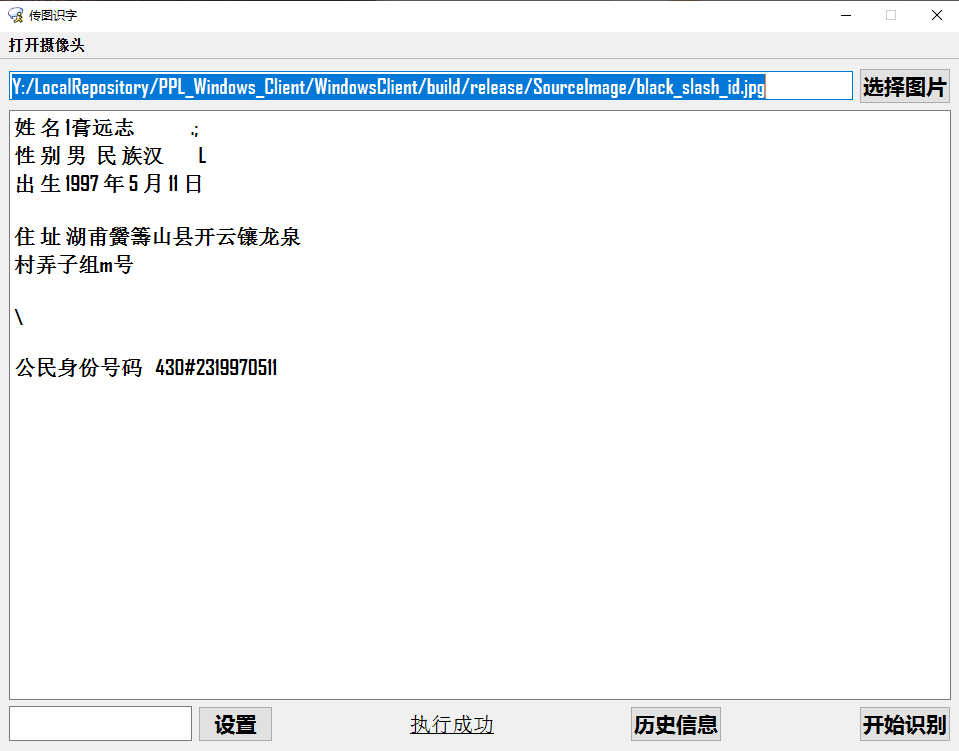
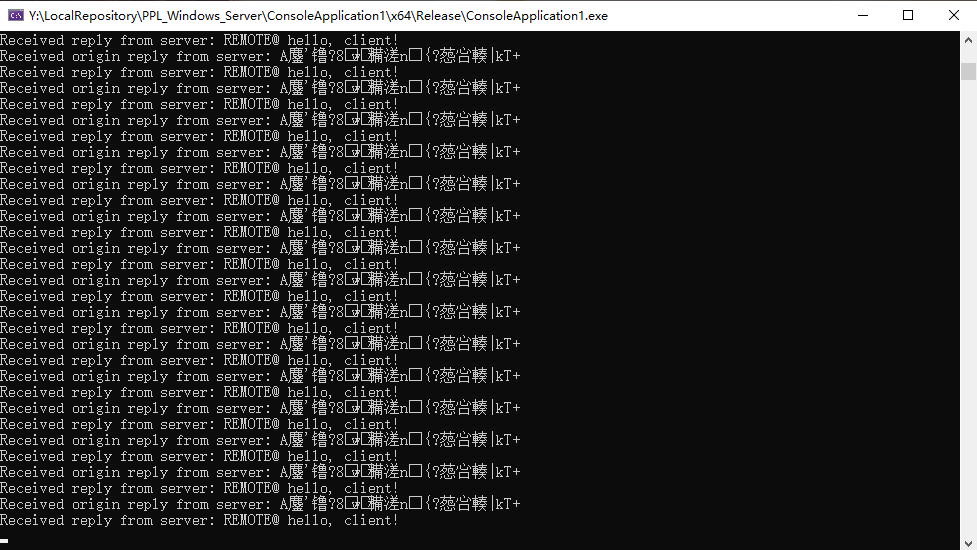
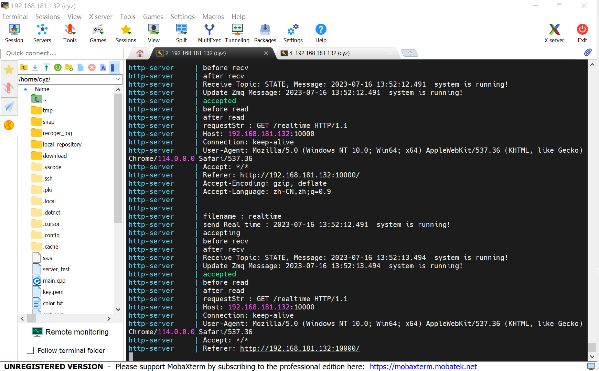
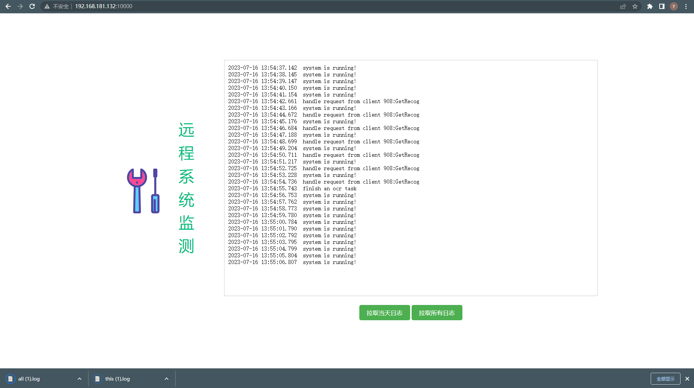

# 项目架构介绍

该项目是围绕“传图识字”搭建的一套软件系统，包括：1）提供传图识字功能的Windows服务端与客户端，2）提供远程监测功能的Linux服务端，3）还有基于Github与Docker的CI/CD流程，整体项目架构如下图所示：

## 工作流程

1. work-server通过UDP协议将自身的IP地址广播到局域网中，work-client接收到UDP数据包后，基于OpenSSL将服务器的IP地址解析出来，然后逐个尝试建立TCP连接。
2. work-client基于OpenCV实现目标检测（矩形框）与照片拍摄。
3. work-client把待识别图片传送给work-server，然后work-server基于OpenCV完成图片预处理，基于Tesseract-OCR完成字符识别，最后回传给work-client进行回显。
4. work-client可通过日历控件指定目标日期时间，向work-server请求检索历史信息。
5. work-server基于spdlog与sqlite实现本地日志存储。
6. work-server与ZMQ server之间通过ZMQ的req/rep协议进行通信，work-server将自身状态信息实时发送给ZMQ server。
7. ZMQ server收到从work-server传过来的状态信息并成功解码后，将会立即回复确认收到。两者之间借此实现了一个心跳机制，若work-server等待回复超时，将会强制自身下线。
8. ZMQ server在收到新的状态信息后，将会把它插入MySQL数据库，并再以特定报文头将消息发布出去。
9. HTTP server订阅特定报文头的消息，在收到消息后立即更新其消息缓存。当Web客户端向HTTP  server请求实时状态信息时，HTTP server将会把缓存中的消息回复给Web客户端。另外，HTTP server也提供日志下载服务。
10. 当从Linux开发服务器向Github推送dev分支后，Github将会自动触发一个将dev分支合并到main分支的流程。在前述流程执行完毕后，将会再基于main分支触发一个自动构建Docker镜像，并推送新镜像到Docker hub的流程。
11. 在Linux服务器中，可基于shell脚本可选的从本地源码构建Docker镜像，也可从Docker hub上拉取现成镜像，从而启动Docker compose服务。

## 代码仓库

* 基于QT C++开发work-client

  <https://github.com/mybullet/PPL_Windows_Client>

* 基于VS C++开发work-server

  <https://github.com/mybullet/PPL_Windows_Server>

* 基于PyCharm Python开发work-server中的图像处理与识别功能

  <https://github.com/mybullet/PPL_Python_Ocr>

* 基于QT C++开发work-server中的UDP广播服务器

  <https://github.com/mybullet/PPL_Udp_Broadcast>

* 基于Linux CMake开发ZMQ server和HTTP server

  <https://github.com/mybullet/PPL_Cmake_Zmq_Server>

  <https://github.com/mybullet/PPL_Cmake_Http_Server>

* 基于Node.js和Vue开发Web前端界面

  <https://github.com/mybullet/PPL_Web_Vue>

* 基于Docker compose的Linux系统启动配置

  <https://github.com/mybullet/PPL_Docker_Compose>

## 运行示例

* **Windows client**

* **Windows server**

* **Linux server**

* **Web page**

